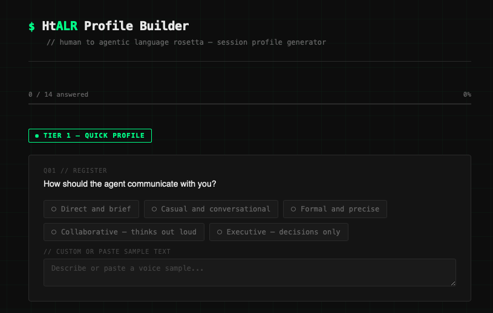
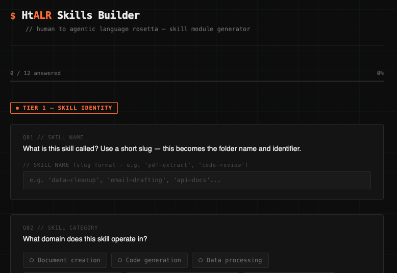
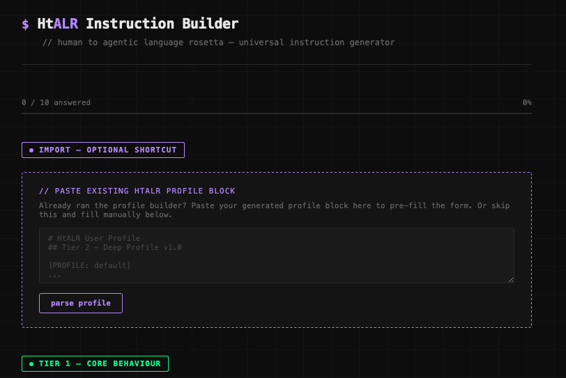

# HtALR
## Human to Agentic Language Rosetta

A methodology and toolset for reducing translation loss between human intent and agentic execution.

HtALR works like a shell profile — loaded at session start, shaping all subsequent interactions. It distributes the translation burden between human and agent by contextual advantage, builds a shared compressed language over time, and makes failure fast, cheap, and recoverable.

---

## What's in this repo

```
HtALR/
├── HtALR-first-principles.md              — foundational methodology
├── HtALR-profile-instructions.md          — active session profile (add to Claude project)
├── HtALR-profile-builder.html             — tiered profile generation tool
├── HtALR-profile-builder-instructions.md  — how to rebuild the profile builder
├── HtALR-skills-builder.html             — skill module (SKILL.md) generation tool
├── HtALR-skills-builder-instructions.md  — how to rebuild the skills builder
├── HtALR-instruction-builder.html         — universal instruction block generator
└── HtALR-instruction-builder-instructions.md — how to rebuild the instruction builder
```

---

## How it works

### 1. The problem

When a human sends a query to an agent, something is always lost. The human expresses intent in natural language — abstract, affective, partially formed. The agent operates on tokens and probability. The gap between these two systems produces unoptimised execution: the agent guesses wrong, loops on clarifying questions, or defaults to an averaged output that serves no one particularly well.

HtALR treats this as a translation problem and builds the interface layer between the two systems.

### 2. The methodology

Four first principles — documented in full in `HtALR-first-principles.md`:

| Principle | Core question | Answer |
|-----------|---------------|--------|
| Translation burden | Who does the translation work? | Shared — each party owns what they have context for |
| Minimum viable specification | What needs to be specified, and how much? | The intent tuple — seek context, trust declarations, build shared language |
| Mode detection | How does the agent know how to behave? | Detect execution vs discovery — declare explicitly via flags |
| Failure as signal | What happens when it breaks? | Make failure detectable, commit corrections back to the profile |

### 3. The profile

The profile is a markdown instruction block added to a Claude project. It pre-tunes agent behaviour before the first message — register, output format, autonomy, constraints, failure mode, and a flag system for per-query overrides.

```markdown
[PROFILE: default]

### Register
- Tone: Direct, casual
- Pleasantries: None
- Style: Bash shell with personality — terse, factual, flared where appropriate

### Output
- Default format: Markdown
- Preamble: None
- Postamble: None

### Autonomy
- Default: Ask before acting when ambiguous
```

### 4. The flag system

Flags modify agent behaviour per query. Append to any message. Stackable.

| Flag | Behaviour |
|------|-----------|
| `-lfg` | Execute without clarifying questions — course-correct on output |
| `-yolo` | Maximum speed and efficiency — all responses in millennial speak |
| `-q` | Quiet mode — conclusion only, no rationale |
| `-v` | Verbose mode — full reasoning and working shown |
| `-o [format]` | Override output format e.g. `-o json`, `-o prose`, `-o table` |
| `-d` | Draft mode — output flagged with confidence and assumptions inline |
| `-halp` | Options mode — return 2-3 recommended approaches before committing |
| `-obey` | Strict mode — literal execution only, no inference beyond the query |
| `-toboldlygo` | Discovery mode — explore possibility space, surface options, capture reactions |
| `-nevermore` | Poetry mode — all outputs phrased as poetry or prose |
| `-makeitso` | Commit mode — commits query context as a change to the instruction file |
| `-help` | Help mode — show flag list, offer to add a new flag |

---

## The tools

Three standalone HTML tools. Open in any browser — no server, no framework, no build step.

### Profile Builder
`HtALR-profile-builder.html`

Generates a session profile block. Tiered reveal — 3 questions unlock 11 deeper ones. Multiple choice with custom override on every question. Outputs a markdown profile block ready to paste into a Claude project.



### Skills Builder
`HtALR-skills-builder.html`

Generates a `SKILL.md` — a structured instruction file an agent loads before executing a specific category of task. Covers skill identity, input/output spec, execution steps, quality rules, constraints, dependencies, and bundled resources.



### Instruction Builder
`HtALR-instruction-builder.html`

Generates a universal instruction block for any AI assistant — ChatGPT, Gemini, Copilot, Claude, or anything else with a system prompt field. Includes an import shortcut: paste an existing HtALR profile block and the form pre-fills automatically.



> Screenshots above require a `docs/` folder with preview images. Replace with actual screenshots or remove the image lines until ready.

---

## Getting started

### Add the profile to Claude

1. Open [Claude.ai](https://claude.ai) and create a new project
2. Add `HtALR-profile-instructions.md` to the project files
3. The agent will read the Active Profile and Flag Reference at the start of every session

### Run the profile builder

1. Open `HtALR-profile-builder.html` in any browser
2. Answer Tier 1 questions — Tier 2 unlocks on completion
3. Click "generate profile" — copy the output block
4. Paste into your project's instruction file or use as a standalone system prompt

### Run the instruction builder

1. Open `HtALR-instruction-builder.html` in any browser
2. Optional: paste an existing HtALR profile block to pre-fill the form
3. Complete the questions — click "generate instructions"
4. Paste the output into the custom instructions or system prompt field of any AI assistant

### Update the profile mid-session

Append `-makeitso` to any message to commit a change to the profile:

```
always use tables instead of bullet lists for comparisons -makeitso
```

The agent updates the profile, increments the version, and logs the change.

---

## Rebuilding the tools

Each HTML tool has a companion instructions file. To regenerate or extend a tool, use its prompt template (found in the instructions file) with Claude:

```
Build a standalone HtALR Profile Builder HTML file using the Profile Builder
instructions I am providing. Output a single complete .html file I can open
in any browser with no server or build step required.

Changes from base version:
  [LIST ANY CHANGES]
```

All three builders follow the same conventions — same aesthetic, same tier gate pattern, same output format. The instructions documents cover question architecture, CSS variables, JS patterns, output generation logic, and customisation checklists.

---

## Contributing

This is a private repo and a personal methodology — not currently open for external contributions.

That said: if you're using HtALR and find yourself extending the flag set, adding new profile dimensions, or building tools on top of the methodology, notes and feedback are welcome via the issues tab.

---

## License

MIT. Use, modify, and distribute freely. Attribution appreciated but not required.

---

*HtALR v1.2*
*Project: human to agentic language rosetta*
